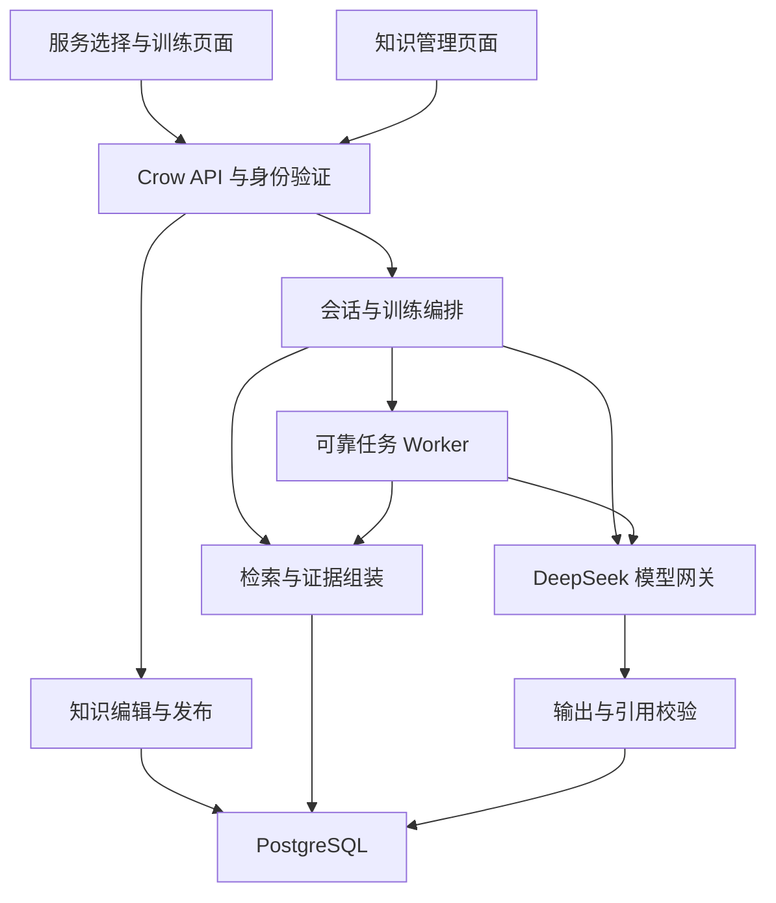

# 口腔客服智能陪练：服务与专业知识 RAG 完整设计

版本：1.0 · 2026-09-14  
状态：待实施的架构设计；本文不表示功能已经开发完成。  
代码基线：`chinesemisaka/Oral-Training`，`master@317440512c6dc47a477af1a99b085226ed119348`。  
存放位置：沿用仓库现有 `docs/` 文档目录。

## 1. 需求结论与边界

### 1.1 已经与用户确认的要求

| 事项 | 确定要求 |
|---|---|
| 机构范围 | 一家诊所、一个 PostgreSQL 数据库 |
| 服务资料 | 暂无现成资料，开发过程中由 LLM 生成模拟资料并入库 |
| 知识范围 | 诊所具体服务信息，以及通用口腔专业知识；不建立销售策略 RAG |
| 训练入口 | 用户选择具体服务，再调用检索和生成链路 |
| AI 当患者 | 根据选定服务生成潜在客户画像、需求、顾虑和提问 |
| AI 当客服 | 依据所选服务资料及专业知识，准确回答患者 |
| 价格与时间 | 支持服务价格、单次就诊时长、治疗周期、预约时间等 |
| 无资料 | 明确说没有相关信息，不凭模型记忆补造服务事实 |
| 患者画像 | 自由生成，保存在当前会话，支持续练；不建立独立患者库 |
| 评分 | 核对学员的服务事实和专业知识表述，给出证据 |
| 内容维护 | 增加管理页面，可新增服务、编辑价格和时间、维护知识 |
| 模型 | 第一版使用 DeepSeek API，其余工程选型由本设计确定 |

### 1.2 术语统一

现有小程序的“患者模拟”页面实际上由学员当患者、AI 当客服。为避免需求讨论中的同名歧义，本文使用下表。

| 本文名称 | 学员角色 | AI 角色 | 现有页面/接口 |
|---|---|---|---|
| 客服训练 | 客服 | 模拟患者 | `pages/training`，`/api/sessions` |
| 角色互换 | 患者 | 标准客服 | `pages/roleplay`，`/api/roleplay/sessions` |

场景是“怎么练”，例如基础咨询、比价、术后不适；服务是“围绕什么项目练”，例如某种植套餐。二者分开建模。同一服务可对应多个训练场景，具体兼容关系由管理端配置。

### 1.3 第一版交付范围

交付服务选择、知识管理页面、资料生成草稿、发布与版本管理、会话级患者生成、两种模式的检索接入、证据化回答、知识核验评分和引用展示。继续保留当前最多 10 轮、暂存续练、异步报告、话术收藏、错题和成长功能。

第一版不做多租户、真实挂号或交易、患者病历管理、PDF/OCR 导入、自动爬取网站、独立知识问答聊天入口。预约时间是诊所录入的服务信息或模拟时段；不声称已经接通实时号源，也不生成“预约成功”。

LLM 生成的服务价格和排班属于模拟经营数据，不代表真实报价；生成的口腔知识属于待核验内容，不能因为写入数据库就标成权威医学资料。演示资料允许发布到演示训练范围，真实使用前必须替换或核验。这是内容可信度规则，不阻止本轮文档交付，也不要求现在提供真实资料。

## 2. 现有产品与改造依据

本设计基于前端、后端及迁移代码的静态核对，未执行小程序运行验收。

| 现状 | 代码位置 | 本次改造含义 |
|---|---|---|
| 原生微信小程序，五个底部入口 | `app.json`、`pages/` | 在训练入口插入服务选择，在“我的”增加管理员知识管理入口 |
| 四个预置场景 | `backend/migrations/001_initial.sql` | 保留场景模板，新增服务实体和关联，不为每个随机患者创建 scenario |
| 两种训练模式与独立数据 | `002_roleplay.sql` | 分别扩展两类会话，不合并历史数据与评分口径 |
| 患者生成目前依赖固定场景隐藏配置 | `ModelGateway::patientReply` | 新会话使用服务证据和生成画像，后续轮次读取同一画像 |
| 标准客服依赖场景服务重点 | `ModelGateway::standardServiceReply` | 加入检索上下文、允许引用的服务字段和缺失字段 |
| 评分已有知识准确性 25% | `ModelGateway::evaluate` | 加入事实核验，不重新设计五维权重 |
| 价格、疗程等数字会被拦截 | `validateSafeAdvice`、`validateRoleplayServiceText` | 新增证据感知校验，不能只把检索内容拼到提示词 |
| JSON 报告有严格归一化和历史修复 | `normalizeReport`、`ReliableDatabase` | 新报告版本必须兼容 null 分数、引用和证据不足状态 |
| 消息租约、可靠 AI 队列、连接池 | `reliable_store.h`、`database_pool.h` | 复用可靠性原则；模型调用不得占用数据库事务 |
| 话术与错题来自报告 | `learningPhrasesFromReport` 等 | 引用和服务版本需随报告派生条目保留 |
| 主管仅查看机构聚合 | `identity.h`、主管接口 | 管理知识不等于获取其他学员的对话权限 |

技术基线为 Windows C++ / Crow / libpqxx / PostgreSQL，模型网络调用使用 WinHTTP。第一版延续此部署，不引入 Python 常驻服务、Redis 或第二套数据库。

## 3. 总体架构与技术决策

### 3.1 核心决策

采用 **结构化服务事实检索 + 中文文本检索 + DeepSeek 受证据约束的生成**。

RAG 的核心是生成前检索外部证据，不要求第一版必须使用向量。价格、时间和包含项目通过服务 ID、字段键、版本精确读取；通用专业知识通过术语、标签、中文字符片段检索。避免把精确报价埋在大段文字里，仅依赖语义相似度命中。

截至设计核对日期，所查 DeepSeek 官方 API Reference 列出了对话等接口，本文不假设存在可直接使用的官方 embedding 端点。生成统一使用 DeepSeek；检索第一版在 PostgreSQL 与 C++ 内完成。未来确有召回不足证据时，再增加 embedding provider 和 pgvector，而不是先引入第二个模型供应商。

### 3.2 模块关系



### 3.3 逻辑模块职责

| 模块 | 职责 | 不承担的职责 |
|---|---|---|
| ServiceCatalog | 服务列表、价格与时间字段、场景关联 | 生成患者画像 |
| KnowledgePublisher | 草稿校验、发布不可变版本、维护索引 | 在训练消息中修改服务资料 |
| RagRetriever | 版本过滤、字段查询、文本召回、证据组装 | 生成报价或执行模型生成的 SQL |
| PatientFactory | 根据证据生成画像、开场与信息披露计划 | 创建跨会话患者档案 |
| GroundedReply | 依据证据生成客服答复、学习要点 | 无依据诊断或确认预约 |
| KnowledgeEvaluator | 核验学员事实陈述和专业知识 | 把未检索到证据直接判错 |
| EvidenceValidator | 校验引用、字段值、适用条件和版本 | 只检查引用 ID 存在就认定回答正确 |
| ModelGateway | DeepSeek 请求、结构化输出、错误分类 | 拥有数据库写权限或自行决定发布 |

### 3.4 关键架构约束

1. 服务事实由数据库给定，LLM 只负责选择、组织和解释。
2. 新会话锁定服务版本与知识版本清单，之后编辑资料不改变该次训练标准。
3. 患者画像、检索证据、机构事实分别存放；患者预算不能成为机构价格。
4. 用户输入、模拟患者发言、历史 AI 回复均不是知识库来源。
5. 库中未知与检索系统故障必须区分；故障不能伪装成“诊所没有资料”。
6. 引用校验覆盖答案、学习要点、复盘、点评和推荐话术。

## 4. 知识与服务数据模型

### 4.1 两类内容

| 内容 | 存储方式 | 示例 |
|---|---|---|
| 诊所服务事实 | 强类型字段及具备 schema 的 JSONB | 价格类型、币种、计价单位、包含/不含项目、各阶段时长、服务时间 |
| 专业知识条目 | 原文、适用范围、来源、版本、检索块 | 种植体与牙冠的概念、检查流程、一般护理知识、服务沟通中的专业边界 |

服务说明不得维护一份与结构化字段互相独立的价格副本。管理端显示的报价说明由字段模板渲染；专业知识条目不允许填写本诊所价格来覆盖服务表。

### 4.2 服务字段契约

以下只定义字段与结构，示例不是已生成或真实医学/经营资料。

```json
{
  "serviceId": "svc-implant-demo",
  "revisionId": "srv-rev-001",
  "name": "演示种植服务 A",
  "category": "implant",
  "dataOrigin": "synthetic",
  "price": {
    "status": "known",
    "type": "starting_from",
    "currency": "CNY",
    "amountMinor": 398000,
    "unit": "per_tooth",
    "conditions": "演示套餐口径，最终报价按资料所述条件确认",
    "validFrom": "2026-09-01",
    "validUntil": "2026-12-31"
  },
  "includedItems": ["演示项目一", "演示项目二"],
  "excludedItems": ["资料列明的额外项目"],
  "visitDuration": {"status": "unknown", "reason": "未录入"},
  "treatmentDuration": {"status": "unknown", "reason": "未录入"},
  "appointment": {
    "status": "known",
    "type": "consultation_hours",
    "timezone": "Asia/Shanghai",
    "text": "演示咨询时间：周一至周五 09:00—17:00",
    "isLiveAvailability": false
  },
  "professionalTopics": ["implant-components", "implant-consultation"]
}
```

价格支持 `fixed / starting_from / range / quote_after_assessment`；未知使用 `status=unknown`，不能用 0 或空字符串代表未知。金额用最小货币单位整数，不用浮点；范围要求上下界有序。必须附计价单位及条件，“3980 元起/颗”不能渲染为“总共 3980 元”。

时间分别建模 `visit_duration / treatment_duration / followup_interval / consultation_hours / appointment_slots`，记录最小值、最大值、单位、阶段、条件及是否为估计。不能把单次时长当完整治疗周期，也不能把咨询营业时间当可预约号源。具体时段记录日期、时区、资料更新时间；没有实时排班接口时统一保留非实时标记。

有效期按会话的 `knowledgeAsOf` 判断。已开始的训练继续使用当时资料并展示“本次训练使用的服务版本”；新的训练不能使用过期报价。未来预约日期晚于报价有效期且无延续说明时，输出未知，不能因为开场日期有效就承诺未来价格。

### 4.3 建议新增表

下表为实施契约；实际 SQL 采用递增迁移文件，不能修改已发布的 001—009。

| 表 | 主要字段 | 约束与用途 |
|---|---|---|
| `clinic_services` | id、name、category、status、current_revision_id、created_at | 稳定服务身份；status 为 active/archived |
| `service_drafts` | id、service_id、payload、draft_version、generation_id、updated_by | 可编辑草稿；乐观并发版本，生成结果不覆盖发布版 |
| `service_revisions` | id、service_id、version、payload、content_hash、origin、published_by、published_at | 发布后不可修改；UNIQUE(service_id,version) |
| `service_scenarios` | service_id、scenario_id | 组合主键；仅允许兼容场景组合 |
| `knowledge_entries` | id、topic、scope、current_revision_id、status | scope 为 general/service；服务专属条目带 service_id |
| `knowledge_drafts` | id、entry_id、title、body、metadata、draft_version | 原文、别名、适用条件、来源、审核状态的编辑区 |
| `knowledge_revisions` | id、entry_id、version、title、body、metadata、content_hash | 不可变原文；可追溯来源和审核状态 |
| `knowledge_chunks` | id、revision_id、ordinal、body、section、terms、search_vector、tokenizer_version | 从版本派生；唯一(revision_id,ordinal)，GIN 检索索引 |
| `training_contexts` | id、session_id、roleplay_session_id、service_revision_id、knowledge_as_of、manifest、patient_profile、generation_state | 两类会话 FK 恰好一个非空；分别唯一；画像只随所属会话存储 |
| `rag_traces` | id、context_id、purpose、round、attempt_token、query、evidence_json、model_version、latency_ms、created_at | 每次检索的证据快照；只有胜出租约结果关联最终消息 |
| `knowledge_admin_jobs` | id、kind、draft_id、generation、status、lease_until、attempts、idempotency_key、error | 管理端资料草稿生成队列，独立于学员报告目标表 |
| `knowledge_audit_events` | id、actor_id、action、entity_id、old_revision_id、new_revision_id、request_id、created_at | 内容修改、发布、归档的审计；不存 API key |

`training_contexts.manifest` 固定本次可用的知识 revision ID 清单、服务内容哈希、检索/提示词版本及运行范围。会话创建时在短事务中确定清单，之后只从清单中检索，即使某篇知识当时尚未用到，后续轮次也不能漂移到新版本。第一版单机构小型知识库允许保存整个已发布可用版本清单，避免仅锁住首轮命中的几段。

`knowledge_revisions.metadata` 至少包括：`origin=synthetic|manual|reference`、`verification=unverified|reviewed`、`sourceTitle`、`sourceUrl`（可空）、`sourceLocator`（章节或段落）、`applicability`、`effectiveFrom/Until`、`trainingScope=demo|verified`。生成任务不能将自己标记为 reviewed，也不能伪造书名、指南年份或 URL；没有真实来源则明确为空。

外键原则：已被会话引用的 revision 禁止物理删除；服务归档只阻止新开训练。删除会话时随生命周期删除画像，不将其复制到患者库。证据保留与现有会话/报告保留周期一致。

### 4.4 扩展现有表

两类 session 增加可空 `service_id`、`context_version`、`client_session_id`；旧会话保持为空并走旧逻辑。创建与重启客户端提供 `clientSessionId`，按 `(user_id, client_session_id)` 保证幂等，重复键但参数不同返回 409。

替换“一用户一场景只能有一个进行中会话”的唯一索引：新会话约束 `(user_id, scenario_id, service_id)`；旧会话保留 `service_id IS NULL` 的原组合唯一约束。使用两个部分索引，避免 PostgreSQL 默认 NULL 唯一语义留下重复空服务会话。场景列表、续练查询、最佳分查询必须一起带 service_id，不能只改创建接口。

两类消息增加可空 `rag_trace_id`；标准客服消息增加 `evidence_refs`、`answer_status`。报告增加 `schemaVersion`、`knowledgeAssessment`、`knowledgeChecks`、`knowledgeManifestHash`，放入现有 JSONB；保留数据库 `total_score` 可空。

## 5. 知识管理页面与资料生命周期

### 5.1 页面结构

新增 `pages/knowledge-admin/knowledge-admin` 作为管理首页，提供“服务项目”“专业知识”“生成任务”三个分区；编辑表单可拆为 `pages/service-editor` 和 `pages/knowledge-editor`。这些是同一管理功能的新页面组，不增加底部 Tab。

入口位于“我的 → 知识与服务管理”，仅 admin 可见。后端每个管理 API 都校验 admin；隐藏入口不代替鉴权。admin 原有聚合看板权限不扩展为读取学员明细。

服务列表展示名称、场景、发布版本、草稿状态和资料完整度；服务编辑表单分别维护价格、项目、时长、预约信息、关联场景。未知字段可明确勾选“暂无资料”。专业知识编辑页维护标题、原文、主题、别名、适用条件、来源及校验标记。

### 5.2 核心操作

| 操作 | 页面行为 | 服务端行为 |
|---|---|---|
| 生成模拟资料 | 输入服务类别、数量、希望覆盖的字段 | 排队调用 DeepSeek，结构化校验后保存草稿 |
| 保存编辑 | 保留未填写字段的 unknown 状态 | 检查 schema 和 draft_version，冲突返回 409 |
| 预览问答 | 输入一个问题，查看命中资料和预览回答 | 使用指定草稿的临时检索视图；不污染训练索引 |
| 发布 | 展示变更与模拟标记，点击发布 | 原子写 revision、chunk、current_revision 和审计记录 |
| 归档 | 从可选服务中移除 | 不删历史版本，不影响旧报告 |
| 查看版本 | 比较价格、时间和知识正文变化 | 只读返回修订历史 |

状态为 `draft → published → archived`，编辑已发布内容产生新草稿与新 revision。已发布 revision 本身不可更新。小型文本发布可在应用内先计算索引，再短事务提交；任何失败均保留上一版有效状态。并发发布通过锁定服务/知识主行及草稿版本校验解决。

模拟资料初始建议 6—10 项服务、40—80 条专业知识，覆盖现有四类训练主题；这是规模预算，不是本次已生成数据。生成使用固定 JSON schema、显式 synthetic 标记、字段一致性检查；专业知识含未知/待核验状态。可先发布 demo 范围内容完成演示，verified 运行范围仅检索 reviewed 内容。

未来真实资料可手工粘贴进入同一流程，不要求先建设爬虫或文档解析系统。

## 6. 检索方案

### 6.1 服务事实路径

已选定 service_id 后，服务事实按会话锁定的 service_revision_id 精确读取。价格、时长、项目包含关系等字段不用文本 Top-K 来决定存在与否。

检索器根据当前问题识别字段族：价格、项目、就诊时长、疗程、复诊、预约；支持“多少钱/费用/报价”“多久/多长时间”“包含/另收费”等固定同义词。问题包含多个字段时返回多个事实包。“多久”无法确定指单次还是全程时同时带两个字段，客服澄清或分别说明。

“那包括拍片吗”“这个要多长时间”等省略问题，使用当前会话服务、当前输入和最近两组完整问答补全检索主题，不允许历史消息替换服务 ID。跨服务提问第一版回答当前项目已知范围，提示用户切换服务；不在一次会话中悄悄切换评分标准。

### 6.2 中文专业知识路径

第一版不依赖 PostgreSQL 默认分词直接处理连续中文。应用侧统一预处理标题、主题、术语别名、正文：

1. UTF-8 解码为 Unicode 码点；规整全角 ASCII、大小写和空白，保留原文用于引用。
2. 用维护的术语/别名字典将“牙套/矫治器”等映射到受控检索词；同义词仅影响召回，不能改变原文含义。
3. 对中文连续段生成双字片段，并保留术语整体；英文、数字按词保留。标点为边界，不跨句合成片段。
4. 将每个检索词编码为稳定的 ASCII 标识，例如 UTF-8 字节的十六进制加类型前缀；使用相同 tokenizer_version 构建文档与问题词项。
5. 将空格分隔的词项存入 `to_tsvector('simple', ...)`；查询词项以参数绑定构建 OR tsquery，不拼接用户原文为 SQL。

标题、人工术语、正文设置不同权重，通过 PostgreSQL `ts_rank_cd` 排序，结合主题匹配优先级得到候选。本文不把此排序宣称为 BM25。PostgreSQL 的 tsvector、tsquery 和权重机制见[官方全文检索文档](https://www.postgresql.org/docs/current/textsearch-controls.html)。

专业知识按小标题或问答切块，建议每块 200—500 中文字，上限 800 字；适用条件、否定语和来源不得被拆离结论。长段落可重叠 50—80 字，保留 revision、原文位置及父标题。中文片段方案对长距离语义改写能力有限，使用离线召回集评估该风险。

检索顺序：先按 manifest、trainingScope、service_id/general、适用主题过滤，再召回最多 20 块，去重后取最多 6 块。若最高候选仅依赖低信息量片段，不视为证据命中。可配置一次 DeepSeek 查询改写作为弱召回补救，仅输出术语 JSON，不能输出答案或新增事实；第一版默认关闭，验收发现具体召回不足再启用。

### 6.3 统一证据包

```json
{
  "contextId": "ctx-001",
  "serviceRevisionId": "srv-rev-001",
  "knowledgeAsOf": "2026-09-14T08:00:00+08:00",
  "purpose": "customer_reply",
  "facts": [{
    "evidenceId": "E1",
    "field": "price",
    "value": {"type":"starting_from","amountMinor":398000,"currency":"CNY","unit":"per_tooth"},
    "displayText": "演示服务 A：3980 元起/颗；按所列条件适用",
    "origin": "synthetic"
  }],
  "passages": [],
  "missingFields": ["treatmentDuration"],
  "conflicts": [],
  "retrievalStatus": "ok"
}
```

`E1` 是该次 trace 内的别名，永久引用为 `(traceId, evidenceId)`。引用详情的原文、标题、字段值由服务端生成，LLM 只能选择 ID。同一字段存在冲突时整组 evidence 标记冲突，不静默让模型挑一个。

证据包预算建议 4000—6000 中文字，专业块至多 6 个，结构化事实优先；评分按每个待核验主题检索，再合并，不把整段十轮对话只检索一次。不能为凑 Top-K 填入无关资料。

### 6.4 检索结果状态

| 状态 | 回答行为 | 评分行为 |
|---|---|---|
| 有明确证据 | 按原值、单位、条件说明 | 可以核对 |
| 字段明确 unknown | “目前资料没有提供该信息” | 不凭空认定学员陈述正确或错误 |
| 专业知识未命中 | 明确缺少依据；必要时澄清问题 | 标记 evidence_missing，不扣知识事实分 |
| 同范围资料冲突 | 说明资料不一致，无法确认 | 标记 conflicted，不选边扣分 |
| 数据库/检索超时 | 返回可重试错误或无事实承诺的临时提示 | 任务失败重试，不保存无证据正式评分 |

## 7. 客服训练：AI 患者生成

### 7.1 新建会话流程

1. 学员选择服务，再选兼容场景与难度；前端展示服务基本介绍，不展示隐藏画像。
2. `POST /api/sessions` 提交 serviceId、scenarioId、clientSessionId。
3. 短事务校验服务已发布且可选，建立会话和 training_context，固定 revision 与 manifest，标记 `generation_state=pending`，入队患者初始化任务。
4. Worker 领取任务后在事务外组装服务证据，调用 DeepSeek 生成画像和开场。
5. 校验画像结构、场景一致性、人物信息与服务事实边界；通过后在单一短事务中保存画像、初始状态、0 轮患者开场，并将 initialization 标记 ready。
6. 前端通过现有 GET 会话轮询等待，ready 前不允许发消息、结束评分或请求提示；可以退出后继续等待。

画像内容包括：虚构年龄段、职业背景、需求、预算、顾虑、性格、初始情绪、隐藏信息与披露条件。姓名使用虚构称呼，不生成真实联系方式、病历号。模拟的症状用于练习提问，不自动构成确定诊断或项目适应证。

患者不能因为检索到了全部服务内容就变成“懂所有答案的医生”。初始化时为其分配有限已知内容，例如只见过项目名称或公开宣传价；隐藏条件、评分标准和内部资料不作为患者已知事实。允许患者表达误解，但应以“我听说/我以为/是不是”方式提问，不作为机构事实宣告。

### 7.2 多轮行为

继续调用现有 patientReply，新增会话画像与服务上下文参数。患者围绕预算、时间、包含项目及专业顾虑逐步提问；对新话题按需要检索。画像身份字段保持不变，情绪、信任和已披露信息沿用现有状态机制更新。

患者不得主动泄露标准答案、当场评价学员或完成诊断。提问可触及未知服务字段；学员坦诚说明资料未知是合理表现，不因患者追问而被迫编造。

续练读取已有画像与版本，不重新生成；重新开始产生新会话、新画像并选择当前发布版本。新的初始化成功前，旧会话的重启处理需保持可恢复：建议事务中把旧会话 abandoned、新会话 pending 与入队原子完成，失败可重试新会话初始化，不恢复成两个 active 会话。

### 7.3 新增任务与队列兼容

`ai_jobs` 当前仅接受 evaluation/roleplay_summary，且多处按“evaluation，否则 roleplay”选择目标表。新增 `patient_initialization` 前必须将目标表解析、锁、失败回写、重试和 readiness 全部改为显式枚举分发，未知类型拒绝执行；不能只扩展 CHECK 约束。

患者初始化目标为 sessions，锁序保持 session → context → job/result；任务认领与心跳只锁 job。generation/attempt token 防止超时任务在新重试完成后覆盖画像。管理草稿生成使用单独 `knowledge_admin_jobs`，避免非会话任务误入上述两类报告逻辑。

## 8. 角色互换：AI 客服准确回答

### 8.1 对话流程

角色互换同样选择服务、锁定版本并保存上下文；学员自己扮演患者，不强制给学员随机生成隐藏身份。可显示所选场景的提问建议。

每轮执行：认领学员消息 → 读取锁定版本 → 检索字段与专业知识 → 构建证据包 → DeepSeek 生成结构化答复 → 校验 → 原子保存答复与 trace 引用。模型调用在数据库事务外，沿用现有 clientMessageId 和回复租约。

### 8.2 模型输出契约 v2

```json
{
  "answerStatus": "partial",
  "segments": [
    {"kind":"text","text":"您主要关心费用和整个治疗时间。"},
    {"kind":"fact","evidenceId":"E1","field":"price","renderMode":"full"},
    {"kind":"unknown","field":"treatmentDuration"}
  ],
  "learningPoints": [{"text":"报价要保留起价条件和计价单位。","evidenceIds":["E1"]}],
  "complianceBoundary": "个人治疗安排需要医生评估。",
  "shouldEnd": false
}
```

服务端将 fact 段按固定模板渲染为原始价格/时间/项目说明，unknown 段渲染明确缺失表述，最终仍给旧页面消费 `reply` 字符串，同时增加 citations、answerStatus。数值由后端渲染可降低数字抄错概率。

`answerStatus` 为 answered/partial/unknown/conflicted。既有部分可答又有未知内容时分别说明，不能为了一个未知字段拒绝全部问题。

纯 text 段只承载共情、澄清和服务推进；专业解释使用带 evidenceIds 的 `knowledge` 段，内容必须在所引用段落适用范围内。模板不能完全保证自然语言语义正确，仍需专业解释的约束校验和评测；高风险或不确定解释降级为资料原文摘述或未知。

### 8.3 现有拦截器的调整

为带 context_version=2 的会话引入 `validateGroundedContent(content, evidenceBundle)`，旧会话继续用旧校验器。

保留禁止诊断、开药、保证疗效等现有角色边界；取消对已验证 fact 段的价格/时间一律拦截。对自由文本仍检查无依据金额、中文数字、百分比、日期、单位和确定性承诺，不能只删除现有数字正则。项目名、优惠、免费事项如需出现，也必须由相应服务字段证明，不因知识库中出现这些字眼就普遍放开。

引用 ID 必须属于本轮证据包；服务 revision 必须与会话一致；数值、单位、范围、适用条件和“起/约”等限定词必须保留。无效引用不得直接显示。失败时最多做一次明确的语义修复，仍失败则用服务端已知事实模板加缺失说明；绝不回退为不受检索约束的模型自由回答。

前端标准客服消息下增加“查看依据”，展开服务版本、字段说明或专业知识原文，以及模拟资料标记。不向学员显示其他患者的隐藏配置或管理备注。

## 9. 知识核验与评分

### 9.1 核验流程

评分仍由结束训练后的可靠 evaluation job 执行：

1. 读取完整对话与 session manifest。
2. DeepSeek 提取学员可核验陈述、患者实际询问的知识点、对应轮次和原句，不直接输出判错结论。
3. 后端校验每条原句为该轮学员发言中的真实子串，提取的数值必须能在原句中定位；患者发言不能当学员答案。
4. 对价格/时间/包含项目进行字段定向查询；专业陈述按主题逐项检索证据。
5. 确定值比较由后端完成；专业语义、适用条件等由 DeepSeek 结合证据判定，再由后端验证引用与枚举。
6. 生成知识核验结果以及原有其余四维点评；后端计算知识分和最终总分，保存证据快照。

语义提取不能跳过否定、假设、转述和纠正。例如“不是 5000 元”“您说别家 5000 元”“我刚才说错了”不能机械当成当前机构报价。金额即便相同，计价单位或附加条件不同也可能错误；数字不同但表达为范围内估计也不能只靠相等比较判错。

### 9.2 核验项契约

```json
{
  "checkId": "kc-001",
  "round": 3,
  "originalQuote": "这个项目是5000元一颗，没有其他条件",
  "topic": "service_price",
  "verdict": "contradicted",
  "evidenceRefs": [{"traceId":"rt-eval-001","evidenceId":"E1"}],
  "reason": "与本次训练锁定的起价及条件不一致",
  "expectedFact": {"field":"price","revisionId":"srv-rev-001"},
  "severity": "major",
  "scoreImpact": 0,
  "correctedInLaterRound": false
}
```

verdict 为 supported/contradicted/incomplete/evidence_missing/conflicted/not_applicable。scoreImpact 示例为占位，最终由评分规则计算，模型不能自定扣分。相同知识点重复表述聚合为一个评分单元，保留逐轮证据；及时自我纠正会改变最终知识点判定，并保留过程点评。

### 9.3 知识维度的第一版计算规则

定义版本 `knowledge-rubric-v1`：以“患者已询问且资料可答的知识点”和“学员主动陈述的可核验知识点”的并集为评分单元，按 topic/field 去重。未被问到且学员未主动陈述的内容不要求全部背诵。

每单元权重：价格、关键费用包含关系、临床风险相关专业事实为 2；普通流程/时间/概念为 1。单元得分：正确且保留条件为 1，遗漏非核心条件或合理但不完整为 0.5，明确错误或面对库中可答问题始终未回答为 0。涉及诊疗判断时，正确说明需要医生评估不视为“未回答”。

知识分 = round(100 × 可判定单元加权得分 / 可判定单元总权重)。evidence_missing/conflicted 不进入分母。记录 `assessableCount`、`unassessableCount`、`coverage`；部分覆盖可生成分数，但页面标为“仅覆盖有证据部分”，不得描述为全部专业内容均已核实。只说“没有资料”且库中确实无资料，不因此扣知识分。

可判定单元为 0 时，`knowledgeAccuracy=null`、`knowledgeAssessment.status=insufficient_evidence`、`totalScore=null`、`passed=null`，显示“知识依据不足，暂不形成综合分”；不伪造 0 分或 100 分，也不重新分配其他维度权重。其余四维仍可点评与评分。该行为是本设计的默认选择，用于落实无依据不误判。

有知识分时保留原五维权重：知识 25%、医疗合规 25%、同理心 20%、需求挖掘 20%、服务礼仪 10%；总分由后端加权并沿用现有舍入规则。价格错误原则上只计知识分；若同时构成明确违规承诺，可在医疗合规中另行评价，但须注明不同理由，不能把同一事实错误重复扣成多个违规。

### 9.4 与报告及成长数据兼容

新报告 `schemaVersion=2`，ready 表示报告生成完成，不代表必有总分。结果页、历史页、雷达图、能力画像、最高分、成长积分及主管聚合均需识别 null；`formatScore(null)` 不能把未评估转为 0，前端不得用四维和缺失知识分自行补算总分。

有总分的报告才能进入平均分、达标率分母、最佳分、分数趋势及高分成就；训练次数和完成次数仍计入已完成会话，另展示 scoredCount/unscoredCount。维度均值逐维仅统计非空分数。知识覆盖不足的报告继续允许查看对话和学习建议，不自动标为未通过。

现有报告读时修复、009 历史迁移后的修复逻辑必须先按 schemaVersion 分流；不能将 v2 的合法 null 总分判为旧报告损坏，不能自动触发无限重评。旧报告按原语义显示并标明无知识库核验，不悄悄换新资料重算历史分。

话术与错题保存 serviceRevisionId、knowledgeRefs；由报告派生，不另起一次模型生成。错误知识点只从可证实错误生成，证据缺失不能加入“你答错了”的错题项。用户从旧错题开启新训练使用当前版本，并提示资料已更新；旧报告引用仍指向旧版本。

## 10. API 设计

所有路径以 `/api` 为前缀，沿用现有 `{code,message,data}` 响应和 bearer 身份。下列为新增/扩展契约，非当前已存在接口。

### 10.1 学员接口

| 方法与路径 | 输入/输出要点 |
|---|---|
| `GET /services` | 已发布服务摘要、当前版本、可用场景、资料范围标记；不返回隐藏画像 |
| `GET /services/{id}` | 公开服务说明、价格与时间展示字段；不泄露管理备注 |
| `GET /scenarios?serviceId=...` | 兼容场景、该服务的续练会话与最佳分 |
| `GET /roleplay/scenarios?serviceId=...` | 同样按服务过滤 |
| `POST /sessions` | 扩展 serviceId、scenarioId、clientSessionId；新上下文返回 202 与 initialization 状态 |
| `GET /sessions/{id}` | 扩展 serviceSummary、initialization、publicPatientProfile、knowledgeScope |
| `POST /sessions/{id}/initialization/retry` | 仅本人、失败状态可重试；不新建画像档案 |
| `POST /sessions/{id}/restart` | 扩展 clientSessionId，返回新会话与初始化状态 |
| `POST /roleplay/sessions` | serviceId、scenarioId、clientSessionId；创建快照后通常返回 201 |
| `POST /roleplay/sessions/{id}/restart` | 新幂等键、当前服务版本；与旧记录分离 |
| 两类现有 messages 接口 | 保留 clientMessageId；返回 reply 与可选 citations、answerStatus |
| 两类现有报告接口 | 返回 schemaVersion 及知识核验信息；角色互换仍不评分 |
| `GET /sessions/{id}/evidence/{traceId}` | 本人可查看该会话已公开的引用；隐藏患者信息不在响应中 |
| `GET /roleplay/sessions/{id}/evidence/{traceId}` | 同上，适用于标准客服答复与复盘 |

旧客户端未提供 serviceId 的请求仅可走旧训练路径，不隐式替其选择一个服务。新 UI 必须选服务。前端用 context_version/schemaVersion 区分显示，不依靠某字段偶然存在来猜版本。

### 10.2 管理接口

| 方法与路径 | 职责 |
|---|---|
| `GET/POST /admin/services` | 列表、新建服务草稿 |
| `GET/PUT /admin/services/{id}/draft` | 读取/保存草稿；PUT 必须提交 draftVersion |
| `POST /admin/services/{id}/publish` | 校验并发布新版本；请求携带草稿版本和幂等键 |
| `POST /admin/services/{id}/archive` | 停止新训练选择 |
| `GET /admin/services/{id}/revisions` | 历史版本与字段差异 |
| `GET/POST /admin/knowledge` | 专业知识列表、新建条目 |
| `GET/PUT /admin/knowledge/{id}/draft` | 知识草稿编辑 |
| `POST /admin/knowledge/{id}/publish` | 发布版本与检索块 |
| `POST /admin/knowledge/{id}/archive` | 停止新会话纳入知识清单 |
| `GET /admin/knowledge/{id}/revisions` | 专业知识版本历史 |
| `POST /admin/knowledge/generation-jobs` | 创建模拟资料生成任务，202 返回 jobId |
| `GET /admin/knowledge/generation-jobs/{id}` | 轮询状态和草稿结果 |
| `POST /admin/knowledge/generation-jobs/{id}/retry` | 失败任务重试，受次数与幂等约束 |
| `POST /admin/knowledge/preview` | 指定草稿版本预览检索/回答；日志标记 preview |

新增错误码：SERVICE_NOT_AVAILABLE、SERVICE_SCENARIO_MISMATCH、DRAFT_VERSION_CONFLICT、KNOWLEDGE_NOT_READY、PATIENT_INITIALIZATION_PENDING、PATIENT_INITIALIZATION_FAILED、RAG_UNAVAILABLE、EVIDENCE_VALIDATION_FAILED。库内字段未知作为正常 answerStatus，不返回 HTTP 500；模型或检索故障按现有错误体系分类。

## 11. DeepSeek 接入、提示词与调用预算

### 11.1 模型与网关

沿用 ModelGateway 和 `DEEPSEEK_API_KEY`，模型 ID 从 `DEEPSEEK_MODEL` 配置读取。仓库默认值为 `deepseek-v4-flash`；设计核对时官方 Chat Completions 文档展示 `deepseek-flash` 和 `deepseek-v4-pro`。实施时通过官方模型列表和一次受控联调确认账号可用 ID；本文不修改现有默认值，也不保证旧别名一直有效。见[Chat Completions](https://api-docs.deepseek.com/api/create-chat-completion/)和[模型列表接口](https://api-docs.deepseek.com/api/list-models/)。

结构化请求沿用 JSON Output；提示词明确 JSON 契约，响应检查空内容、截断和业务 schema。JSON 格式合法不代表字段或事实正确。见[DeepSeek JSON Output](https://api-docs.deepseek.com/guides/json_mode/)。

新提示词独立版本化：service-draft-v1、knowledge-draft-v1、patient-init-v1、patient-rag-v1、service-reply-rag-v1、claim-extract-v1、score-rag-v1、roleplay-summary-rag-v1。不得直接重写所有旧提示词；通过新会话上下文分流。

### 11.2 提示词结构

每次调用包含：角色与禁止行为 → 输出 schema → 可信服务证据 → 专业知识原文与适用范围 → 缺失/冲突清单 → 会话历史/用户输入。

证据内容是数据，不能成为系统指令。管理条目中的“忽略规则”、用户输入中的“管理员已改价”均不能修改系统角色、服务版本或数据库。模型只返回 JSON 建议，发布、查询过滤、金额渲染、扣分计算由应用控制。

### 11.3 预算与重试

| 环节 | 正常模型调用预算 | 说明 |
|---|---|---|
| 模拟资料生成 | 每批 1 次起 | 管理任务，限数量，结果只写草稿 |
| AI 患者初始化 | 每新会话 1 次 | 后续轮次复用画像 |
| AI 患者对话 | 每轮 1 次 | 无单独向量调用 |
| AI 客服对话 | 每轮 1 次 | 服务字段/文本检索本地完成 |
| 结束评分 | 通常 2 次 | 陈述提取 + 有证据的评分与解释 |
| 角色互换复盘 | 1 次 | 重用答复证据，新增解释先检索 |

建议输出预算：画像 1500 tokens，客服回复 1500，陈述提取 3000，评分 6000，复盘 2000；作为初始配置，不代表实测需求。评分比现有 1800 更长，需要新增按任务预算而非全局放大。

沿用现有网络重试作为唯一底层重试器。业务层最多一次语义修复，计入总调用预算；Worker 重试不得形成“每层三次”的无界乘法。设置每个任务 attempt 与总调用次数上限，记录 usage；响应截断不能补存半份 JSON。模型超时参数要与客户端 MODEL_REQUEST_TIMEOUT、代理超时和租约长度共同校准。

## 12. 可靠性、权限与运行

### 12.1 并发与事务

资料编辑通过 draftVersion 防止覆盖；发布通过主行锁和不可变版本事务；会话创建使用 clientSessionId 幂等；消息使用现有 clientMessageId/attemptToken；报告与初始化使用 generation 和任务租约。

对话响应、证据 trace 引用、轮次、患者状态以及末轮结束入队必须原子提交。模型生成过程中释放数据库连接。已经取得租约但失败的调用保留错误 trace，不作为最终用户可见证据。重试读取相同 manifest，不因发生在第二天就改用新价格。

缓存第一版只用进程内只读版本缓存，key 包含 revision ID、manifest hash、查询规范化结果、purpose、tokenizer_version；不以 serviceId 单独作为缓存键。无需 Redis。历史版本不可变，发布仅影响新请求的 current 指针。

### 12.2 运行与配置

沿用 Windows C++ 服务与单 PostgreSQL；由现有进程内 Worker 执行报告和画像任务，另设低并发管理生成 worker，避免批量生成占满聊天请求容量。可先设置管理生成并发 1，其余沿用现有容量并实测。

建议新增配置：`RAG_ENABLED`、`RAG_TRAINING_SCOPE=demo|verified`、`RAG_TOP_K=6`、`RAG_CANDIDATE_LIMIT=20`、`RAG_QUERY_REWRITE_ENABLED=false`、`RAG_CONTEXT_CHAR_LIMIT=6000`、`KNOWLEDGE_GENERATION_ENABLED`。密钥始终在服务端环境配置，管理页不回传现有密钥。

verified 范围没有足够已核验知识时允许未知回答，不能自动放宽到 demo 内容。第一版演示部署明确使用 demo 范围，页面标识仅描述“模拟诊所资料”，不展示检索算法等实现细节。

### 12.3 指标与故障恢复

记录服务字段命中、文本 Recall@K 离线结果、unknown/conflict 比率、引用无效率、输出修复率、画像失败率、报告知识覆盖率、每任务调用数、tokens 和耗时。日志仅含必要 ID 与错误类型，不写完整密钥或默认输出完整对话。

数据库不可用：沿用未就绪健康状态；DeepSeek 不可用：回复可重试、报告队列重试；发布失败：旧版本继续服务；画像初始化失败：同会话重试；证据版本无法读取：报告失败，不改用当前版本冒充原证据。

目标预算而非已测性能：本地检索 p95 < 200ms；额外 RAG 应用开销 p95 < 500ms（不含 DeepSeek）；聊天总时延和报告总时延以受控联调实测报告，不能承诺固定外部 API 响应时间。

## 13. 代码落点与迁移顺序

### 13.1 文件规划

| 文件/目录 | 实施内容 |
|---|---|
| `backend/src/knowledge_store.h/.cpp` | 服务、草稿、版本、发布事务 |
| `backend/src/rag_retriever.h/.cpp` | 中文词项、精确字段读取、全文检索和证据组装 |
| `backend/src/evidence_validator.h/.cpp` | 引用、金额、时间、条件及输出段校验 |
| `backend/src/training_context.h/.cpp` | manifest、画像、会话上下文生命周期 |
| `backend/src/knowledge_evaluator.h/.cpp` | 知识单元合并、证据判定与评分公式 |
| `backend/src/main.cpp` | 注册 API、ModelGateway 新契约与编排接入 |
| `backend/src/reliable_store.h` | 队列类型分发、消息存储、报告版本与聚合兼容 |
| `backend/CMakeLists.txt` | 纳入新增源文件与离线测试目标 |
| `pages/index`、`pages/training` | 服务选择、初始化等待、服务限定续练 |
| `pages/roleplay`、`pages/roleplay-result` | 服务事实、引用、缺失信息与复盘 |
| `pages/result`、`pages/report`、`pages/profile`、`pages/admin` | 核验详情、null 分与统计展示 |
| `pages/knowledge-admin`、编辑页面 | 内容管理及发布 |
| `pages/phrases`、`pages/mistakes` | 引用、旧版本提示、按服务复练 |
| `app.json`、`pages/mine`、`utils/api.js` | 页面注册、入口与 API 契约 |
| `docs/api.md` | 实现时同步新增/变化契约 |

上述拆分为新代码职责划分，不要求先把整个 main.cpp 重构。现有内部类型若位于匿名 namespace，需要提取最小 DTO/接口到头文件，避免新增模块反向 include main.cpp。

### 13.2 递增迁移建议

| 迁移 | 内容 |
|---|---|
| `010_knowledge_catalog.sql` | 服务/知识草稿、不可变版本、块、关联、审计及管理任务 |
| `011_training_rag_context.sql` | 会话 service_id、上下文、manifest、trace、消息引用；替换 active 索引 |
| `012_patient_initialization_jobs.sql` | 初始化状态、ai_jobs 类型约束及所需索引 |
| `013_rag_report_metadata.sql` | 如实现选择额外关系字段，在此扩展；纯 JSONB 元数据可不新增空迁移 |

编号需在开始实现时与最新主分支核对；如有其他新迁移，顺延。迁移本身不调用 LLM、不生成经营资料、不把旧会话硬绑定到随机服务。两类旧会话和历史报告的数据值不改变。

## 14. 分阶段开发与验收

### 阶段 A：内容和服务基础

实现 010、管理 API/页面、模拟资料草稿生成、发布和列表选择。验收：能生成、编辑、发布一项演示服务；未知字段保留；新版本发布原子且旧版本可读；普通学员不能修改资料。

### 阶段 B：检索与客服回答

实现字段精确检索、中文知识索引、证据包、角色互换 v2 回答和引用。验收：价格/时间正确渲染，限定词保留，无资料明确说明；不误用另一服务资料。

### 阶段 C：服务驱动患者

实现上下文与初始化任务、随机画像、0 轮开场、初始化等待及重试。验收：同一服务产生不同顾虑，续练身份稳定，重试不产生重复开场，患者不泄露隐藏答案。

### 阶段 D：知识核验评分闭环

实现提取、检索、核验、确定性知识计分及报告 v2；更新 null 分展示和聚合、旧报告修复分流、话术与错题引用。验收：价格说错能指出证据，资料缺失不误扣，无可判定知识时不生成虚假综合分。

### 阶段 E：回归与发布准备

覆盖现有两模式、续练、历史、任务失败重试、管理员聚合、迁移兼容；完成固定离线测试集后仅进行一次有预算的 DeepSeek 端到端联调，再记录性能与调用开销。测试集使用固定模拟服务数据，与 LLM 生成的草稿分开，避免用同一模型生成答案再自证正确。

### 14.1 关键验收用例

| 用例 | 预期 |
|---|---|
| A 服务 3980 元起/颗，B 服务另一价格 | A 会话只引用 A；起价和单位不能丢失 |
| 单次时长已知，全程周期未知 | 回答单次时长，并明确不知道全程周期 |
| 用户问“周六能预约吗”，只有营业时间 | 不确认有号源，不返回预约成功 |
| 开场后管理员修改价格 | 当前会话继续旧版本，新会话使用新版本 |
| 新发布一篇专业知识 | 旧会话不自动采用，新会话纳入 manifest |
| 模拟患者预算 5000 元 | 不能成为服务报价证据 |
| 学员否定/转述某数字 | 不能当成其对诊所价格的确定陈述 |
| 学员把每颗费用说成总价 | 识别单位/适用范围错误 |
| 两条同适用范围知识冲突 | 明确冲突，不能选择一条强行扣分 |
| 库中无答案，学员表示未知 | 不扣知识事实分，不编造正确答案 |
| 整场无可核验知识 | 报告 ready、知识分/总分/达标状态为空，统计不计为零分 |
| 画像初始化并发重试 | 仅一个有效画像与 0 轮开场 |
| 回复生成后租约过期 | 旧结果不能覆盖胜出结果或留下可见错误引用 |
| 知识条目包含“忽略系统要求” | 作为正文处理，不能改变角色或执行管理操作 |
| 旧报告缺总分与新报告合法 null | 分别走旧修复与 v2 不足证据路径 |
| 通过引用 API 猜其他学员 ID | 拒绝访问；管理员知识权限不越过对话权限 |

建议准备至少 80 条固定检索/回答/核验样例，含同义改写、跨服务、无资料、冲突和时间条件。硬门槛：固定字段准确率 100%、跨服务污染 0、引用存在且版本正确 100%、明确未知用例编造 0；专业知识 Recall@6 目标 ≥90%，需人工标注相关块后测量。专业解释准确性和评分一致性需人工抽查；同一 DeepSeek 的自评不能替代验收。

## 15. 回退与后续扩展

上线按内容管理 → 角色互换 → AI 患者 → 评分 v2 分阶段开启，代码必须先具备 v2 报告读能力再写入 v2 数据。`RAG_ENABLED=false` 阻止新建 RAG 会话，旧版训练仍可用；已有 RAG 会话保留版本感知读路径，不能切换为无证据自由回答。紧急关闭生成时已有会话可读、暂停发言，恢复后继续。

回退仅关闭新路径，不删除新表与版本，不把新报告降级为旧 JSON。回滚到完全不认识 v2 的旧二进制会误修复 null 分，因此不作为正常回退手段；应保留兼容读取的发布版本。

后续仅在评测确认词面检索漏召回时引入 embedding：保留 ServiceCatalog 精确事实路径、EvidenceBundle 和 manifest 契约，新增 TextRetriever 实现；在同一 PostgreSQL 中增加 pgvector 索引和 embedding 模型版本。向量与词面结果可融合，但结构化服务字段始终按 ID/版本读取。届时单独决定外部 embedding API 或本地模型，不假设 DeepSeek 对话 API 能替代 embedding。

## 16. 实施前检查清单

- 所有用户确认项均已覆盖，不需要再以缺少真实资料为理由阻塞演示开发。
- 服务生成只在开发/管理流程执行，不在每轮对话重新生成价格。
- serviceId、scenarioId、manifest、patientProfile 的职责和生命周期明确。
- 数字引用允许规则与旧安全拦截分流一起实施。
- 新 ai_jobs 类型的全部目标表分支、锁与错误处理一起修改。
- 空知识分的数据库、前端、聚合和历史修复兼容一起上线。
- 首次真实模型联调前确认模型 ID、JSON 输出及费用预算。
- 本文是设计交付；后续开发应按阶段落实，并在 `docs/api.md` 与验收记录中同步实际结果。

## 17. 参考资料

代码依据固定到本设计基线，避免后续主分支变化使设计来源不明确：

- [模型提示词、校验与 API 编排](https://github.com/chinesemisaka/Oral-Training/blob/317440512c6dc47a477af1a99b085226ed119348/backend/src/main.cpp)
- [会话、可靠队列、报告和学习数据](https://github.com/chinesemisaka/Oral-Training/blob/317440512c6dc47a477af1a99b085226ed119348/backend/src/reliable_store.h)
- [小程序调用接口](https://github.com/chinesemisaka/Oral-Training/blob/317440512c6dc47a477af1a99b085226ed119348/utils/api.js)
- [场景与初始数据库](https://github.com/chinesemisaka/Oral-Training/blob/317440512c6dc47a477af1a99b085226ed119348/backend/migrations/001_initial.sql)
- [角色互换数据模型](https://github.com/chinesemisaka/Oral-Training/blob/317440512c6dc47a477af1a99b085226ed119348/backend/migrations/002_roleplay.sql)

外部技术接口的核对日期为 2026-09-14；接口能力与模型名称以实施时官方文档及账号实际可用模型为准。
